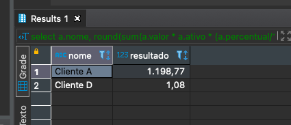
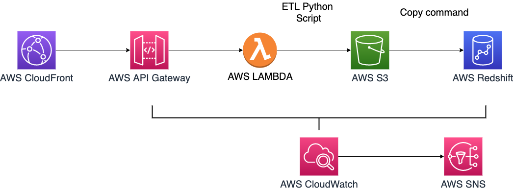

# Data Engineer

###### Candidate: Gabriel Luz

### Entrega 1

O primeiro passa para resolver esse desafio foi criar uma base de dados SQL Server na AWS. Para isso, usei o serviço RDS (Relational Database Service). Esse é o serviço de banco de dados gerenciado pela própria AWS, que abstrai para o usuário várias das etapas relacionadas a administração de uma base de dados. A Figura 1 mostra o print da base de dados em funcionamento e a Figura 2 mostra uma parte da configuração setada inicialmente. Embora não seja boa prática, para esse desafio coloquei o acesso público a base de dados, com o objetivo de não adicionar complicadores como etapas de configuração de tráfego de dados entre as redes na conta da AWS. Para este desafio, também foram usadas as configuraçōes mínimas que um banco de dados SQL Server Server. Com isso, o custo ficou de aproximadamente $34,00 mensais. Por conta disso, todos os recursos criados na AWS serão destruídos assim que todo o desafio for completado. 

|  |
|:--:|
| <b>Figura 1</b>|

|  |
|:--:|
| <b>Figura 2</b>|

Com a base SQL Server disponível no Console da AWS, o próximo passo foi inserir os dados. Para isso, usei a ferramenta DBeaver para rodar o script sql disponibilizado junto com o desafio. A Figura 3 ilustra essa etapa. Uma alternativa melhor para a solução dessa etapa do desafio seria criar a base de dados SQL Server usando Infra as Code, com uma ferramenta como Terraform ou CloudFormation. Isso traria diversos beneficios como documentação da infra e seu versionamento e mais facilidades para cenários de recuperação de desastres. Mas com o objetivo de facilitar o desafio, criei toda a infra pela Console da AWS. 

|  |
|:--:|
| <b>Figura 3</b>|

Com os dados carregados, foi feito um trabalho de exploração das bases de dados para se chegar ao resultado disponilizado inicialmente. Para essa etapa, foi fundamental papel e lapís para entender a relação dos atributos. Basicamente usei contas de padaria para se chegar ao resultado no papel e em seguida, reproduzir o raciocínio em código SQL. Com isso, cheguei na seguinte query, que possui o resultado ilustrado na Figura 4. Para a construção da query, usei a estratégia da sub-query, partindo de dentro para fora. Primeiro fazendo consultas de baixo como um simples select dos nomes de clientes agrupando pelos atributos mais fáceis de localizar. Após interpretar a relação entre as tabelas e os atributos, ficou mais fácil realizar os dois joins e consequentemente, a aquisição de valores das três tabelas. A partir desse ponto fiz consultas buscando relacionar os valores entre as tabelas. Após a etapa de entendimento do cálculo em si, partir para a parte externa da query, que consiste na realização do cálculo em linguagem SQL. 

> select a.nome, round(sum(a.valor * a.ativo * (a.percentual/100) * (1 - a.percentual_desconto/100)),2) as resultado
from
(
SELECT c.cliente_id, c.nome, ct.contrato_id, ct.ativo, sum(t.valor_total) as valor, ct.percentual, COALESCE(t.percentual_desconto,0) as percentual_desconto
FROM   cliente c 
       LEFT JOIN contrato ct 
         ON c.cliente_id = ct.cliente_id
       LEFT JOIN transacao t 
         ON ct.contrato_id = t.contrato_id
WHERE c.nome in ('Cliente A', 'Cliente D')
GROUP  BY c.cliente_id, c.nome,  ct.contrato_id, ct.contrato_id, ct.percentual, t.percentual_desconto, ct.ativo 
) a
GROUP  BY a.nome

|  |
|:--:|
| <b>Figura 4</b>|

### Entrega 2

Neste etapa do desafio, pede-se um código pyspark que retorne o resultado de uma operação matemática em um conjunto de dados em formato não relacional. A primeira abordagem desse problema foi criar uma tabela no DynamoDB e ler via pyspark. Após muitas tentativas, não consegui fazer a consulta via pyspark dessa forma. Com o DynamoDB, só consegui usar a biblioteca boto3 para consultas. A Figura 5 mostra a tabela criada no console da AWS e a Figura 6 mostra uma query geral na tabela criada. Essa tarefa foi feita em um notebook no Google Colab pois não obtive sucesso em rodar o pyspark no meu ambiente local e por conta do prazo, parti para outra abordagem.

|  |
|:--:|
| <b>Figura 5</b>|

|  |
|:--:|
| <b>Figura 6</b>|

Como não obtive sucesso com o DynamoDB, partir para a abordagem de salvar os dados disponibilizados em formato json e carrega-los diretamente no notebook Google Colab através de métodos de importação de arquivos. Essa tentativa acabou não sendo bem sucedida também por conta de erro relacionado a importação do json no Colab, embora o arquivo fosse de fato importato, por algum erro de formatação nenhuma query nele funcinava. 
Com isso, voltei para a abordagem do Jupyter Notebook local na minha máquina. Acabei descobrindo o problema anterior (instalação de Java) e consegui fazer o pyspark rodar na minha máquina local. Mesmo assim ainda obtive erros com a importação do arquivo. A saída para colocar os dados no código foi criar um objeto json e transforma-lo em dataframe, conforme imagem 7 ilustra. 
 
|  |
|:--:|
| <b>Figura 7 </b>|

Com os dados carregados em formato dataframe, o trabalho foi executar a operação matemática desejada. A Figura 8 ilustra o que foi feito. Através do método de dataframe _withColumn_ fui criando as colunas base para a operação e por fim fiz um groupBy com agregação de soma para obter o resultado desejado.

|  |
|:--:|
| <b>Figura 8 </b>|

### Entrega 3

A terceira parte do desafio consistiu em dado um arquivo json, transforma-lo em dataframe, tratando as sub-colunas que estavam aninhadas e em seguida separar os dados seguindo o modelo relacional. Para realizar essa tarefa, usei a linguagem Python através da ferramenta Jupyter Notebook. O arquivo contendo os dados bem como o arquivo do código de transformação de dados estão presentes na pasta "tarefa3" do repositório. O primeiro passo para o desenvolvimento foi a importação das bibliotecas que seriam usadas, conforme abaixo. 

> import json  
import pprint as pp
from pandas.io.json import json_normalize

Em seguida, o que fiz o carregar os dados para dentro do projeto Python. O arquivo json estava no mesmo diretório que o notebook, portando bastou um ./ para informar a localidade. Para carregar os dados foi usado o código abaixo, que usa tanto a estrutura _open_, built-in do Python bem como a biblioteca json e por último a biblioteca pprint, para melhor visualziação dos dados. O output do código é a Figura 5.

> with open('./data.json') as f:
  data_js = json.load(f)
  pp.pprint(data_js)

|  |
|:--:|
| <b>Figura 9</b>|

A etapa seguinte foi transformar os dados de json para dataframe. Nesta etapa, foi necessário uma busca no Google para resolver o problema, uma vez que a último vez que trabalhei esse tipo de transformação foi em 2019. Através da pesquisa, passei por diferentes métodos para realizar essa transformação até que encontrei o método _json_normalize_, da biblioteca pandas. Através da analise da [documentação](https://pandas.pydata.org/pandas-docs/version/0.17.0/generated/pandas.io.json.json_normalize.html) da biblioteca bem como desse [link](https://www.kaggle.com/jboysen/quick-tutorial-flatten-nested-json-in-pandas) do Kaggle, consegui chegar no código abaixo, que produziu o output mostrado pela Figura 6. 

> df = json_normalize(data=data_js, record_path='ItemList', 
                            meta=['CreateDate', 'EmissionDate','Discount', 'NFeNumber', 'NFeID'])
df.head(9)

|  |
|:--:|
| <b>Figura 10</b>|

A última etapa foi separar o dataframe seguindo o modelo relacional. Temos que a tabela resultado da transformação de dados se caracteriza por ser do tipo fato, ou seja, armazena todos os dados de acontecimento de um determinado contexto. Para este desafio, a minha intenção era separar as entidades em diferentes tabelas de dimensão mas por conta do limite de tempo e da quantidade de tabelas desejada, criei apenas uma tabela de dimensão, no caso, para o atributo _ProductName_. A Figura 7 ilustra o que foi feito. 

|  |
|:--:|
| <b>Figura 11 </b>|

### Entrega 4

A última etapa do desafio consiste em propor uma arquitetura de dados na AWS consumindo dados em json de uma API e armazenando-os no Redshift. Para essa tarefa, a Figura 8 ilustra a arquitetura proposta. Imaginando que a API está hospedada no serviço API Gateway e que está por trás de um CloudFront para ajudar a reduzir a latência ao redor do globo caso seja necessário para o negócio, os dados seriam consumidos por uma função Lambda contendo um código de extração, transformação e carregamento de dados. A Lambda precisaria de um código usando uma biblioteca como a request para extrair dados da API mas para a etapa de transformação, um código semelhante ao desenvolvido no item 3 poderia ser usado. Uma vez tendo os dados transformados no S3, seria necessário envia-los com a frenquência desejada para o Redshift, para isso, pode ser usado o comando Copy. É válido mencionar que seria preciso criar roles para a execução do fluxo de dados. Somado ao pipeline de dados em si, adicionei dois componentes com objetivo de monitoramento. O CloudWatch, que realiza a verificação de sucesso ou falha de cada uma das etapas e o SNS (Simple Notification Service), que seria usado para notifição caso algma falha aconteça no pipeline. Fontes comuns de recebimento de alertas são o e-mail e o slack.

|  |
|:--:|
| <b>Figura 12</b>|

A Figura 9 por sua vez, ilustra fontes de dados alternativas para o Redshift. Sendo uma delas o serviço Glue, que pode substituir a Lambda e realizar a etapa de transformação de dados diretamente para o Redshift. Uma outra alternativa para carregamento de dados no Redshift via Lambda é usar o Kinesis Firehose como intermediário.

|  |
|:--:|
| <b>Figura 13 </b>|
Fonte: Curso [[NEW] Ultimate AWS Certified Database Specialty 2022
](https://www.udemy.com/course/aws-certified-database-specialty-dbs/)